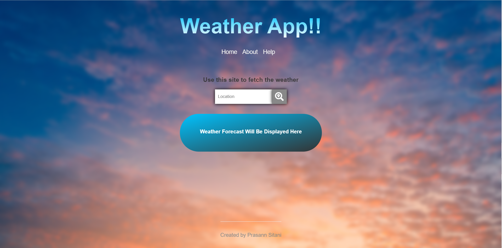

# Weather-Forcasting-Application

A user-friendly platform which provides the descriptive information of the particular location to the users which includes humidity, lowest temperature, highest temperature as well as current status.

## Technologies Used
<ul>
  <li> Node Js </li>
  <li> Handlebars </li>
  <li> Weather Stack Api </li>
  <li> CSS3 </li>
  <li> And many more. </li>
</ul>

---

Live Version : <a href="https://sitani-weather-app.herokuapp.com/" alt="hosted link"> Click here. </a>

---

Application is fully open-source and anyone wants to try it regarding improvement of the application, Just make changes and Pull a request. If, relevant then definetely merged.
